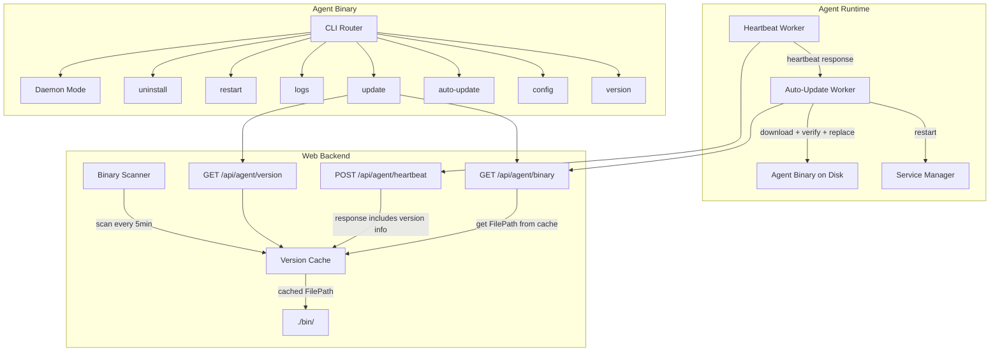

# 设计文档: Agent CLI 子命令与自动更新

## 概述

本设计为 SSL Manager Agent 添加完整的 CLI 子命令框架和自动更新机制。Agent 二进制在保持向后兼容（无子命令时启动守护进程）的同时，新增 `uninstall`、`restart`、`logs`、`update`、`auto-update`、`config`、`version` 七个子命令。Web Backend 新增版本信息接口和心跳响应增强，支持 Agent 自动检测并升级到最新版本。

核心设计决策：
- **CLI 框架**: 不引入第三方 CLI 库（如 cobra），使用标准库 `os.Args` 手动路由子命令，保持二进制体积最小
- **版本比较**: 自实现 SemVer 比较（仅 MAJOR.MINOR.PATCH），避免引入外部依赖
- **原子更新**: 写入临时文件 → `os.Rename` 原子替换，确保更新过程中断电不会损坏二进制
- **版本缓存**: Web Backend 使用内存缓存 + 定时扫描，确保版本检查和下载之间的 MD5 一致性

## 架构



## 组件与接口

### 1. CLI Router (`cmd/agent/main.go`)

重构现有 `main.go`，在 `flag.Parse()` 之前先检查 `os.Args` 是否包含子命令。

```go
// 路由逻辑伪代码
func main() {
    if len(os.Args) > 1 {
        arg := os.Args[1]
        
        // 处理全局 flags
        if arg == "--help" || arg == "-h" {
            printUsage()
            os.Exit(0)
            return
        }
        if arg == "--version" || arg == "-v" {
            cmdVersion()
            return
        }
        
        // 如果第一个参数不是 flag（不以 - 开头），视为子命令
        if !strings.HasPrefix(arg, "-") {
            switch arg {
            case "version":
                cmdVersion()
            case "uninstall":
                cmdUninstall(os.Args[2:])
            case "restart":
                cmdRestart()
            case "logs":
                cmdLogs(os.Args[2:])
            case "update":
                cmdUpdate()
            case "auto-update":
                cmdAutoUpdate(os.Args[2:])
            case "config":
                cmdConfig(os.Args[2:])
            case "help":
                printUsage()
            default:
                fmt.Fprintf(os.Stderr, "unknown command: %s\n\n", arg)
                printUsage()
                os.Exit(1)
            }
            return
        }
    }
    // 无子命令或仅有 daemon flags（如 --config） → 启动守护进程（现有逻辑）
    runDaemon()
}

// printUsage 输出帮助信息
func printUsage() {
    fmt.Println("Usage: ssl-manager-agent [command]")
    fmt.Println()
    fmt.Println("Commands:")
    fmt.Println("  version      显示版本信息")
    fmt.Println("  update       检查并更新到最新版本")
    fmt.Println("  auto-update  查看或设置自动更新状态 (enable/disable)")
    fmt.Println("  restart      重启 Agent 服务")
    fmt.Println("  logs         查看 Agent 日志 (--follow, --lines N)")
    fmt.Println("  config       查看或修改配置 (--server-url, --token, --interactive)")
    fmt.Println("  uninstall    完整卸载 Agent (--yes 跳过确认)")
    fmt.Println("  help         显示此帮助信息")
    fmt.Println()
    fmt.Println("不带命令时启动 Agent 守护进程。")
}
```

### 2. 平台服务管理器抽象 (`internal/agent/platform/`)

```go
// ServiceManager 抽象不同平台的服务管理操作
type ServiceManager interface {
    Stop() error       // 用于: uninstall
    Start() error      // 用于: restart（内部）
    Restart() error    // 用于: restart, update, auto-update
    Disable() error    // 用于: uninstall
    Enable() error     // 用于: 安装脚本（非 CLI 直接调用）
    IsActive() (bool, error)  // 用于: restart（显示状态）
    Uninstall() error  // 用于: uninstall（删除 unit/plist 文件 + daemon-reload/bootout）
    GetLogs(lines int, follow bool) error  // 用于: logs（执行 journalctl/tail）
}

// NewServiceManager 根据 runtime.GOOS 返回对应实现
func NewServiceManager() ServiceManager
```

**Linux 实现 (`systemd.go`)**:
- `Restart()` → `systemctl restart ssl-manager-agent`
- `Stop()` → `systemctl stop ssl-manager-agent`
- `Disable()` → `systemctl disable ssl-manager-agent`
- `Uninstall()` → 删除 `/etc/systemd/system/ssl-manager-agent.service` + `systemctl daemon-reload`

**macOS 实现 (`launchd.go`)**:
- `Restart()` → `launchctl kickstart -k system/com.ssl-manager.agent`
- `Stop()` → `launchctl bootout system/com.ssl-manager.agent`（回退: `launchctl unload`）
- `Uninstall()` → `bootout` + 删除 plist + 删除日志文件（stdout + stderr）
- `GetLogs()` → 读取 `/var/log/ssl-manager-agent.log`；如果 stderr 日志 `/var/log/ssl-manager-agent.err.log` 存在且非空，在输出末尾追加提示："注意：错误日志另见 /var/log/ssl-manager-agent.err.log"

### 3. 版本比较模块 (`internal/agent/version/`)

```go
package version

// Version 表示语义化版本
type Version struct {
    Major int
    Minor int
    Patch int
}

// Parse 解析版本字符串 "MAJOR.MINOR.PATCH"
func Parse(s string) (Version, error)

// Compare 比较两个版本，返回 -1, 0, 1
func Compare(a, b Version) int

// IsNewer 判断 remote 是否比 local 新
func IsNewer(local, remote string) (bool, error)
```

### 4. 更新执行器 (`internal/agent/updater/`)

```go
package updater

// Updater 负责下载、校验、替换二进制
type Updater struct {
    ServerURL   string  // 服务器基础 URL（如 https://ssl-manager.example.com）
    CurrentPath string  // 当前二进制路径（通常 /usr/local/bin/ssl-manager-agent）
    HTTPClient  *http.Client
}

// VersionInfo 从服务端获取的版本信息（扁平结构，已按 OS/Arch 筛选）
type VersionInfo struct {
    Version     string `json:"version"`
    MD5         string `json:"md5"`
    Size        int64  `json:"size"`
    DownloadURL string `json:"download_url"` // 相对路径，如 "/api/agent/binary?os=linux&arch=amd64"
}

// VersionResponse GET /api/agent/version 的完整响应
type VersionResponse struct {
    Version  string        `json:"version"`
    Releases []ReleaseItem `json:"releases"`
}

type ReleaseItem struct {
    OS          string `json:"os"`
    Arch        string `json:"arch"`
    MD5         string `json:"md5"`
    Size        int64  `json:"size"`
    DownloadURL string `json:"download_url"`
}

// CheckVersion 查询最新版本，解析 releases 列表并按 os/arch 筛选匹配项
// 请求: GET <ServerURL>/api/agent/version
// 返回匹配当前平台的 VersionInfo，如果没有匹配项返回 nil
func (u *Updater) CheckVersion(os, arch string) (*VersionInfo, error) {
    // 1. GET ServerURL + "/api/agent/version"
    // 2. 反序列化为 VersionResponse
    // 3. 遍历 releases，找到 os/arch 匹配项
    // 4. 返回 VersionInfo{Version: resp.Version, MD5: match.MD5, Size: match.Size, DownloadURL: match.DownloadURL}
}

// Download 下载二进制到与目标同目录的临时文件，返回临时文件路径
// downloadURL 是相对路径，会拼接 ServerURL 形成完整 URL: ServerURL + downloadURL
func (u *Updater) Download(downloadURL string) (tmpPath string, err error) {
    // 1. 拼接完整 URL: u.ServerURL + downloadURL
    // 2. 下载到 filepath.Dir(u.CurrentPath) + "/ssl-manager-agent.download.tmp"
    // 3. 返回临时文件路径
}

// VerifyMD5 校验文件 MD5
func VerifyMD5(filePath string, expectedMD5 string) error

// AtomicReplace 原子替换二进制文件
// 要求 newFilePath 与 targetPath 在同一文件系统（同一目录），确保 os.Rename 是原子操作
// 步骤：
//   1. 复制 targetPath 的文件权限到 newFilePath
//   2. os.Rename(newFilePath, targetPath) 原子替换
//   3. 如果 rename 失败，删除 newFilePath 并返回错误
func AtomicReplace(targetPath, newFilePath string) error

// Execute 执行完整更新流程: check → download → verify → replace → restart
func (u *Updater) Execute(currentVersion, os, arch string, svcMgr platform.ServiceManager) error
```

### 5. 自动更新 Worker (`internal/agent/worker/autoupdate.go`)

```go
package worker

// AutoUpdateWorker 在心跳响应中检测新版本并自动更新
type AutoUpdateWorker struct {
    config      *agentconfig.AgentConfig
    updater     *updater.Updater
    svcMgr      platform.ServiceManager
    currentVer  string
}

// HandleHeartbeatResponse 处理心跳响应中的版本信息
func (w *AutoUpdateWorker) HandleHeartbeatResponse(resp *HeartbeatResponse) error
```

心跳响应结构增强：

```go
// HeartbeatResponse 心跳响应（新增版本信息字段）
type HeartbeatResponse struct {
    Status        string `json:"status"`
    Message       string `json:"message"`
    LatestVersion string `json:"latest_version,omitempty"`
    MD5           string `json:"md5,omitempty"`
    DownloadURL   string `json:"download_url,omitempty"`
}
```

### 6. Web Backend 版本缓存 (`internal/web/service/version_cache.go`)

```go
package service

// ReleaseInfo 单个平台的发布信息
type ReleaseInfo struct {
    OS          string `json:"os"`
    Arch        string `json:"arch"`
    MD5         string `json:"md5"`
    Size        int64  `json:"size"`
    DownloadURL string `json:"download_url"`
    FilePath    string `json:"-"` // 内部使用，不序列化
}

// VersionCache 管理 Agent 二进制版本信息的内存缓存
type VersionCache struct {
    mu       sync.RWMutex
    version  string
    releases []ReleaseInfo
    binDir   string
    ticker   *time.Ticker
}

// NewVersionCache 创建并启动版本缓存
func NewVersionCache(binDir string, scanInterval time.Duration) *VersionCache

// Scan 扫描二进制目录，更新缓存
func (vc *VersionCache) Scan() error

// GetVersion 获取当前版本号
func (vc *VersionCache) GetVersion() string

// GetReleases 获取所有平台的发布信息
func (vc *VersionCache) GetReleases() []ReleaseInfo

// GetRelease 获取指定 OS/Arch 的发布信息
func (vc *VersionCache) GetRelease(os, arch string) (*ReleaseInfo, bool)

// Stop 停止定时扫描
func (vc *VersionCache) Stop()
```

**扫描逻辑**:
1. 读取 `binDir/agent-version.txt` 获取版本号
2. 遍历 `binDir/ssl-manager-agent-<os>-<arch>` 文件
3. 对每个文件计算 MD5 和文件大小
4. 原子更新内存缓存（加写锁）

### 7. 版本信息 Handler (`internal/web/handler/install_handler.go` 扩展)

在现有 `InstallHandler` 中新增路由和改造下载逻辑：

```go
// InstallHandler 新增 versionCache 依赖
type InstallHandler struct {
    runtimeCfg   *config.RuntimeConfig
    agentDir     string
    versionCache *service.VersionCache  // 新增
}

// RegisterRoutes 注册路由（新增 version 接口）
func (h *InstallHandler) RegisterRoutes(r chi.Router) {
    r.Get("/api/agent/install.sh", h.GetInstallScript)
    r.Get("/api/agent/binary", h.DownloadBinary)
    r.Get("/api/agent/version", h.GetVersionInfo)  // 新增
}

// GetVersionInfo handles GET /api/agent/version
// 支持可选查询参数 ?os=<os>&arch=<arch>：
//   - 不带参数：返回全量 releases 列表
//   - 带 os/arch 参数：仅返回匹配的 release（releases 数组只含一项或为空）
// 这样 Agent 端 CheckVersion 可以直接带参数获取精确结果，减少客户端解析
func (h *InstallHandler) GetVersionInfo(w http.ResponseWriter, r *http.Request)

// DownloadBinary handles GET /api/agent/binary?os=<os>&arch=<arch>
// 改造：必须通过 VersionCache 获取文件路径，确保下载的文件与版本接口返回的 MD5 一致
// 步骤：
//   1. 从 query params 获取 os/arch
//   2. 调用 h.versionCache.GetRelease(os, arch) 获取 ReleaseInfo
//   3. 如果未找到，返回 404
//   4. 使用 ReleaseInfo.FilePath 提供文件（而非直接拼接目录路径）
//   5. 可选：下载前校验当前文件 MD5 与缓存一致，不一致则触发重新扫描
func (h *InstallHandler) DownloadBinary(w http.ResponseWriter, r *http.Request)
```

### 8. 心跳响应增强 (`internal/web/handler/agent_handler.go`)

修改 `Heartbeat` handler，在响应中附加版本信息：

```go
func (h *AgentHandler) Heartbeat(w http.ResponseWriter, r *http.Request) {
    // ... 现有逻辑 ...
    
    // 从心跳请求中获取 OS/Arch
    agentOS := info.OS
    agentArch := info.Arch
    
    // 查询版本缓存
    release, found := h.versionCache.GetRelease(agentOS, agentArch)
    
    resp := HeartbeatResponse{
        Status:  "ok",
        Message: "heartbeat received",
    }
    
    if found {
        resp.LatestVersion = h.versionCache.GetVersion()
        resp.MD5 = release.MD5
        resp.DownloadURL = release.DownloadURL
    }
    
    writeJSON(w, http.StatusOK, resp)
}
```

## 数据模型

### Agent 配置文件 (`config.yaml`) 新增字段

```yaml
server_url: https://ssl-manager.example.com
machine_id: machine-uuid-here
agent_token: secret-token-here
poll_interval_seconds: 60
log_level: info
auto_update: true  # 新增：自动更新开关，默认 true
```

对应 Go 结构体变更：

```go
type AgentConfig struct {
    ServerURL           string `yaml:"server_url"`
    MachineID           string `yaml:"machine_id"`
    AgentToken          string `yaml:"agent_token"`
    PollIntervalSeconds int    `yaml:"poll_interval_seconds"`
    LogLevel            string `yaml:"log_level"`
    AutoUpdate          *bool  `yaml:"auto_update,omitempty"` // nil 视为 true（默认启用）
}

// IsAutoUpdateEnabled 返回自动更新是否启用
func (c *AgentConfig) IsAutoUpdateEnabled() bool {
    if c.AutoUpdate == nil {
        return true // 默认启用
    }
    return *c.AutoUpdate
}
```

### 版本信息 API 响应

**GET /api/agent/version**

```json
{
  "version": "1.2.3",
  "releases": [
    {
      "os": "linux",
      "arch": "amd64",
      "md5": "d41d8cd98f00b204e9800998ecf8427e",
      "size": 12345678,
      "download_url": "/api/agent/binary?os=linux&arch=amd64"
    },
    {
      "os": "linux",
      "arch": "arm64",
      "md5": "e99a18c428cb38d5f260853678922e03",
      "size": 12000000,
      "download_url": "/api/agent/binary?os=linux&arch=arm64"
    },
    {
      "os": "darwin",
      "arch": "amd64",
      "md5": "5d41402abc4b2a76b9719d911017c592",
      "size": 13000000,
      "download_url": "/api/agent/binary?os=darwin&arch=amd64"
    },
    {
      "os": "darwin",
      "arch": "arm64",
      "md5": "7d793037a0760186574b0282f2f435e7",
      "size": 12800000,
      "download_url": "/api/agent/binary?os=darwin&arch=arm64"
    }
  ]
}
```

### 心跳请求体（已有，确认包含 version/os/arch）

注意：现有实现使用 `agent_version` 字段名。为保持向后兼容，Web Backend 应同时接受 `agent_version` 和 `version` 字段，内部统一映射为当前版本号用于版本比较。

```json
{
  "machine_id": "uuid",
  "agent_version": "1.0.0",
  "hostname": "web-server-01",
  "ip": "192.168.1.100",
  "os": "linux",
  "arch": "amd64"
}
```

### 心跳响应体（增强）

```json
{
  "status": "ok",
  "message": "heartbeat received",
  "latest_version": "1.2.3",
  "md5": "d41d8cd98f00b204e9800998ecf8427e",
  "download_url": "/api/agent/binary?os=linux&arch=amd64"
}
```

### 版本文件 (`bin/agent-version.txt`)

```
1.2.3
```

由 Makefile/CI 在构建时写入，与二进制文件放在同一目录。

## 正确性属性

*正确性属性是在系统所有有效执行中都应成立的特征或行为——本质上是关于系统应该做什么的形式化陈述。属性是人类可读规范与机器可验证正确性保证之间的桥梁。*

### Property 1: SemVer 比较正确性

*对于任意*两个有效的语义化版本字符串 a 和 b（格式为 MAJOR.MINOR.PATCH），`Compare(a, b)` 的结果应与按 major → minor → patch 数值逐级比较的结果一致。即：若 a.Major > b.Major 则 a > b；若 major 相等则比较 minor；若 minor 也相等则比较 patch。

**Validates: Requirements 6.3**

### Property 2: MD5 校验正确性

*对于任意*字节序列 content 和其正确的 MD5 哈希值 expectedMD5，`VerifyMD5(file, expectedMD5)` 应返回 nil；对于任意不匹配的 MD5 值，应返回错误。即：`VerifyMD5` 当且仅当文件内容的 MD5 与期望值相等时通过。

**Validates: Requirements 5.4, 6.4**

### Property 3: 原子文件替换完整性

*对于任意*有效的文件内容 newContent 和目标路径 targetPath（目标文件已存在），`AtomicReplace(targetPath, tmpPath)` 成功后，读取 targetPath 的内容应等于 newContent；若 AtomicReplace 失败，targetPath 的内容应与调用前完全相同（不会出现部分写入）。

**Validates: Requirements 5.6, 6.6**

### Property 4: Token 脱敏正确性

*对于任意*长度 >= 8 的 token 字符串，脱敏后的输出应满足：最后 8 个字符与原始 token 相同，前面的字符全部被替换为 `*`，且总长度与原始 token 相同。对于长度 < 8 的 token，应全部显示为 `*`。

**Validates: Requirements 8.1**

### Property 5: URL 验证正确性

*对于任意*字符串 s，URL 验证函数应当且仅当 s 以 `http://` 或 `https://` 开头时返回有效。所有其他字符串（包括空字符串、无协议前缀的域名、ftp:// 等）应被拒绝。

**Validates: Requirements 8.5**

## 错误处理

### Agent CLI 错误处理策略

| 错误场景 | 处理方式 | 退出码 |
|---------|---------|--------|
| 未知子命令 | 打印错误 + 可用命令列表 | 1 |
| 权限不足 | 提示需要 root/sudo | 1 |
| 配置文件不存在 | 提示文件路径和创建方法 | 1 |
| 网络连接失败 | 显示错误 + 配置的服务器地址 | 1 |
| MD5 校验失败 | 丢弃下载文件 + 显示/记录错误 | 1（手动）/ 继续运行（自动） |
| 原子替换失败 | 保留旧二进制 + 记录错误 | 1（手动）/ 继续运行（自动） |
| 服务重启失败 | 记录 critical 日志 | 1（手动）/ 继续运行（自动） |

### 自动更新错误恢复

自动更新采用"失败安全"策略：任何步骤失败都不会影响当前运行的 Agent：

1. **下载失败** → 记录 WARN 日志，下次心跳重试
2. **MD5 不匹配** → 删除临时文件，记录 ERROR 日志，跳过本次更新
3. **替换失败** → 删除临时文件，记录 ERROR 日志，旧二进制不受影响
4. **重启失败** → 新二进制已就位，记录 CRITICAL 日志，下次手动重启时生效

### Web Backend 错误处理

| 错误场景 | 处理方式 |
|---------|---------|
| `agent-version.txt` 不存在 | 版本缓存为空，version 接口返回 404 |
| 二进制文件不存在 | 对应 OS/Arch 从 releases 列表中省略 |
| 扫描目录失败 | 记录错误日志，保留上次缓存数据 |
| MD5 计算失败 | 跳过该文件，记录错误 |

## 测试策略

### 属性测试（Property-Based Testing）

使用 `github.com/leanovate/gopter`（项目已有依赖）实现属性测试，每个属性最少 100 次迭代。

| 属性 | 测试文件 | 生成器 |
|------|---------|--------|
| Property 1: SemVer 比较 | `internal/agent/version/version_property_test.go` | 生成随机 (major, minor, patch) 三元组 |
| Property 2: MD5 校验 | `internal/agent/updater/md5_property_test.go` | 生成随机字节切片 |
| Property 3: 原子替换 | `internal/agent/updater/atomic_property_test.go` | 生成随机文件内容 |
| Property 4: Token 脱敏 | `internal/agent/cli/mask_property_test.go` | 生成随机长度字符串 |
| Property 5: URL 验证 | `internal/agent/cli/validate_property_test.go` | 生成随机字符串（含有效/无效 URL） |

标签格式: `Feature: agent-cli-auto-update, Property {N}: {property_text}`

### 单元测试

| 模块 | 测试重点 |
|------|---------|
| CLI Router | 各子命令路由正确性、--help 输出、未知命令处理 |
| Platform ServiceManager | Mock exec 验证正确的系统命令被调用 |
| Updater | Mock HTTP 验证下载流程、错误处理 |
| VersionCache | 扫描逻辑、缓存更新、并发安全 |
| Config 子命令 | 配置读写、验证逻辑 |

### 集成测试

| 场景 | 测试方法 |
|------|---------|
| 心跳响应包含版本信息 | httptest 模拟完整心跳流程 |
| GET /api/agent/version | httptest 验证 JSON 结构 |
| 完整更新流程 | Mock HTTP server + 临时目录模拟二进制替换 |
| 安装脚本生成 | 验证脚本包含 auto_update: true |

### Makefile 集成

```makefile
VERSION ?= $(shell cat VERSION 2>/dev/null || echo "0.0.0")
BUILD_TIME := $(shell date -u '+%Y-%m-%dT%H:%M:%SZ')
AGENT_LDFLAGS := -s -w -X main.Version=$(VERSION) -X main.BuildTime=$(BUILD_TIME)

# 构建时写入版本文件并注入版本号到二进制
build-agent-release:
    @echo "$(VERSION)" > $(BIN_DIR)/agent-version.txt
    GOOS=linux GOARCH=amd64 CGO_ENABLED=0 go build -ldflags "$(AGENT_LDFLAGS)" -o $(BIN_DIR)/ssl-manager-agent-linux-amd64 ./cmd/agent
    GOOS=linux GOARCH=arm64 CGO_ENABLED=0 go build -ldflags "$(AGENT_LDFLAGS)" -o $(BIN_DIR)/ssl-manager-agent-linux-arm64 ./cmd/agent
    GOOS=darwin GOARCH=amd64 CGO_ENABLED=0 go build -ldflags "$(AGENT_LDFLAGS)" -o $(BIN_DIR)/ssl-manager-agent-darwin-amd64 ./cmd/agent
    GOOS=darwin GOARCH=arm64 CGO_ENABLED=0 go build -ldflags "$(AGENT_LDFLAGS)" -o $(BIN_DIR)/ssl-manager-agent-darwin-arm64 ./cmd/agent
```

Agent `main.go` 中声明编译时注入变量：

```go
var (
    Version   = "dev"
    BuildTime = "unknown"
)
```
