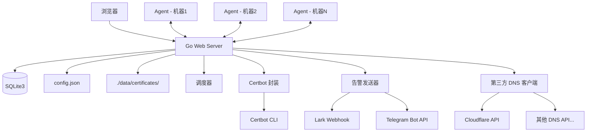
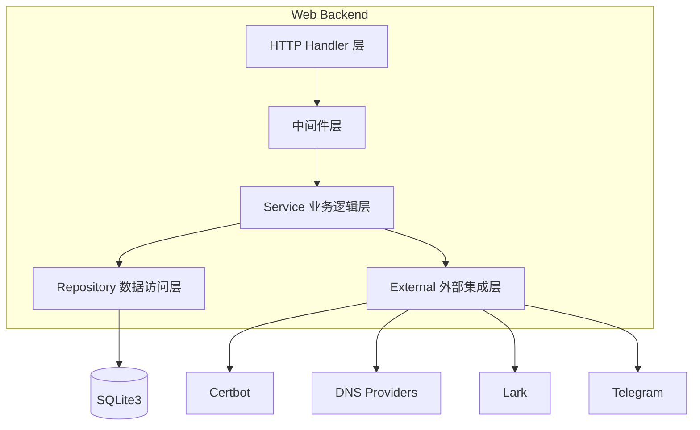
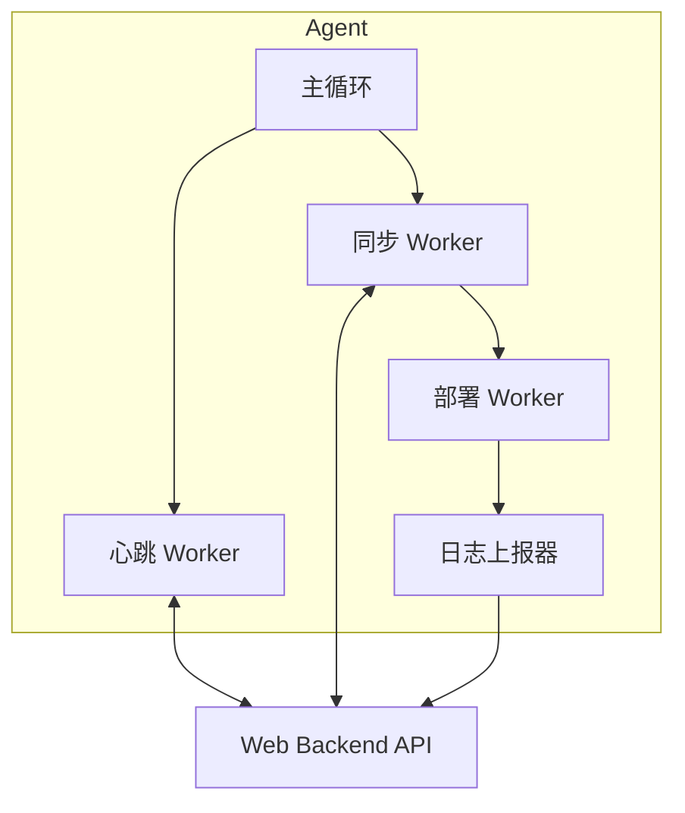

# 设计文档

## 概述

SSL 证书管理系统采用 Go 语言开发，分为 Web Backend 和 Agent 两个独立组件。Web Backend 提供 RESTful API、Web 界面、任务调度和告警功能；Agent 部署在目标 Linux 机器上，负责证书同步和部署。

系统使用 SQLite3 作为持久化存储，config.json 作为全局配置文件。证书不做多版本管理，续签或更新时直接覆盖当前内容。证书 PEM 文件以文件形式存储，SQLite3 只保存元数据。

### 数据目录布局

```text
./data/
├── config.json                          # 全局配置
├── data.sqlite3                         # SQLite3 数据库
└── certificates/
    └── <certificate_id>/
        ├── cert.pem                     # 服务器证书
        ├── chain.pem                    # 中间证书链
        ├── fullchain.pem                # 完整证书链
        └── privkey.pem                  # 私钥
```

## 架构

### 整体架构



### 分层架构



### Agent 架构



## 组件与接口

### Web Backend 组件

#### 1. HTTP Handler 层

负责路由注册、请求解析、响应序列化。

```go
// 路由分组
/api/auth/*          // 认证相关
/api/users/*         // 用户管理
/api/machines/*      // 机器管理
/api/certificates/*  // 证书管理
/api/domains/*       // 域名监控
/api/alerts/*        // 告警管理
/api/thirdpart-dns/* // 第三方 DNS 上游管理
/api/audit-logs/*    // 审计日志
/api/dashboard/*     // 仪表盘
/api/system/*        // 系统配置
/api/agent/*         // Agent 接口
/init                // 初始化
```

#### 2. 中间件层

```go
type Middleware interface {
    AuthMiddleware(next http.Handler) http.Handler      // JWT 认证
    RoleMiddleware(roles ...string) func(http.Handler) http.Handler  // 角色验证
    ReadonlyMiddleware(next http.Handler) http.Handler  // 只读模式拦截：使用接口白名单，非简单 HTTP method 判断
    AuditMiddleware(next http.Handler) http.Handler     // 审计日志
    AgentAuthMiddleware(next http.Handler) http.Handler // Agent Token 认证，校验 machine_id 与 token 对应关系
}
```

#### 3. Service 层接口

```go
type CertificateService interface {
    Create(ctx context.Context, input CreateCertInput) (*Certificate, error)
    Update(ctx context.Context, id string, input UpdateCertInput) (*Certificate, error)
    Delete(ctx context.Context, id string) error
    GetByID(ctx context.Context, id string) (*Certificate, error)
    List(ctx context.Context, filter CertFilter) ([]*Certificate, error)
    ParsePEM(certPEM, keyPEM []byte) (*CertMetadata, error)
    ValidateKeyPair(certPEM, keyPEM []byte) error
    IssueCertbot(ctx context.Context, input CertbotIssueInput) (*Certificate, error)
    Renew(ctx context.Context, id string) error
}

type MachineService interface {
    Create(ctx context.Context, input CreateMachineInput) (*Machine, error)
    Update(ctx context.Context, id string, input UpdateMachineInput) (*Machine, error)
    Delete(ctx context.Context, id string) error
    GetByID(ctx context.Context, id string) (*Machine, error)
    List(ctx context.Context, filter MachineFilter) ([]*Machine, error)
    GenerateToken(ctx context.Context, machineID string) (string, error)
    RevokeToken(ctx context.Context, machineID string) error
    UpdateHeartbeat(ctx context.Context, machineID string, info HeartbeatInfo) error
    GetInstallCommand(ctx context.Context, machineID string) (string, error)
}

type MachineCertificateService interface {
    Create(ctx context.Context, input CreateMachineCertInput) (*MachineCertificate, error)
    Update(ctx context.Context, id string, input UpdateMachineCertInput) (*MachineCertificate, error)
    Delete(ctx context.Context, id string) error
    GetByMachineID(ctx context.Context, machineID string) ([]*MachineCertificate, error)
    MarkPendingSync(ctx context.Context, certificateID string) error
    TriggerManualDeploy(ctx context.Context, machineCertID string) error
}

type DomainMonitorService interface {
    Create(ctx context.Context, input CreateDomainInput) (*Domain, error)
    Update(ctx context.Context, id string, input UpdateDomainInput) (*Domain, error)
    Delete(ctx context.Context, id string) error
    List(ctx context.Context, filter DomainFilter) ([]*Domain, error)
    Probe(ctx context.Context, domainID string) (*DomainMonitorResult, error)
    ProbeAll(ctx context.Context) error
}

type AlertService interface {
    Send(ctx context.Context, alert Alert) error
    TestSend(ctx context.Context, channel string) error
    GetHistory(ctx context.Context, filter AlertFilter) ([]*Alert, error)
    ShouldSuppress(ctx context.Context, alert Alert) bool
    MarkResolved(ctx context.Context, alertID string) error
}

type ThirdpartDNSService interface {
    CreateConfig(ctx context.Context, input CreateThirdpartDNSInput) (*ThirdpartDNS, error)
    UpdateConfig(ctx context.Context, id string, input UpdateThirdpartDNSInput) (*ThirdpartDNS, error)
    DeleteConfig(ctx context.Context, id string) error
    ListConfigs(ctx context.Context) ([]*ThirdpartDNS, error)
    SyncRecords(ctx context.Context, configID string) (*DNSSyncResult, error)
    GetSyncLogs(ctx context.Context, configID string) ([]*ThirdpartDNSSyncLog, error)
}

type SchedulerService interface {
    Start(ctx context.Context) error
    Stop() error
    CheckRenewals(ctx context.Context) error
    CheckHeartbeatTimeouts(ctx context.Context) error
    RunDomainMonitor(ctx context.Context) error
}
```

#### 4. Agent API 接口

```go
// Agent 认证：Authorization: Bearer <agent-token>
// 所有 Agent 接口需验证 machine_id 与 token 的对应关系

POST /api/agent/heartbeat
GET  /api/agent/machines/{machine_id}/certificates
GET  /api/agent/machine-certificates/{machine_certificate_id}/download
POST /api/agent/deployment-logs
```

### Agent 组件

```go
type AgentConfig struct {
    ServerURL           string `yaml:"server_url"`
    MachineID           string `yaml:"machine_id"`
    AgentToken          string `yaml:"agent_token"`
    PollIntervalSeconds int    `yaml:"poll_interval_seconds"`
    LogLevel            string `yaml:"log_level"`
}

// Agent 本地状态文件（/etc/ssl-manager-agent/state.json），重启后恢复
type AgentLocalState struct {
    MachineCertStates map[string]*MachineCertState `json:"machine_cert_states"`
}

type MachineCertState struct {
    MachineCertificateID string `json:"machine_certificate_id"`
    LastSyncedRevision   int    `json:"last_synced_revision"`
    LastSyncedFingerprint string `json:"last_synced_fingerprint"`
    LastDeployStatus     string `json:"last_deploy_status"`
    LastDeployAt         string `json:"last_deploy_at"`
}

type Agent interface {
    Run(ctx context.Context) error
    SendHeartbeat(ctx context.Context) error
    SyncCertificates(ctx context.Context) error
    DeployCertificate(ctx context.Context, config CertDeployConfig) (*DeployResult, error)
    ReportDeployment(ctx context.Context, log DeploymentLog) error
    LoadState() error
    SaveState() error
}

type CertDeployer interface {
    Download(ctx context.Context, machineCertID string) (*CertContent, error)
    EnsureDirectory(path string) error
    ValidateKeyPair(cert, key []byte) error
    WriteFiles(certPath, keyPath string, cert, key []byte) error
    SetPermissions(certPath, keyPath string) error
    ExecuteCommands(ctx context.Context, commands []string, timeout time.Duration) ([]CommandOutput, error)
}
```

## 数据模型

### 数据库表结构

```sql
-- 用户表
CREATE TABLE users (
    id TEXT PRIMARY KEY,
    username TEXT NOT NULL UNIQUE,
    password_hash TEXT NOT NULL,
    role TEXT NOT NULL CHECK(role IN ('admin', 'user')),
    enabled INTEGER NOT NULL DEFAULT 1,
    created_at TEXT NOT NULL,
    updated_at TEXT NOT NULL
);

-- 机器表
CREATE TABLE machines (
    id TEXT PRIMARY KEY,
    name TEXT NOT NULL,
    ip TEXT NOT NULL,
    hostname TEXT DEFAULT '',
    os TEXT DEFAULT '',
    arch TEXT DEFAULT '',
    tags TEXT DEFAULT '',
    remark TEXT DEFAULT '',
    status TEXT NOT NULL DEFAULT 'pending' CHECK(status IN ('pending', 'online', 'offline', 'revoked', 'disabled')),
    agent_version TEXT DEFAULT '',
    agent_token_hash TEXT NOT NULL,
    agent_token_revoked_at TEXT,
    last_heartbeat_at TEXT,
    created_at TEXT NOT NULL,
    updated_at TEXT NOT NULL
);

-- 证书表（元数据，PEM 内容以文件形式存储在 ./data/certificates/<id>/）
CREATE TABLE certificates (
    id TEXT PRIMARY KEY,
    name TEXT NOT NULL,
    domains TEXT NOT NULL,
    source TEXT NOT NULL CHECK(source IN ('upload', 'certbot_cloudflare_dns', 'certbot_manual_dns')),
    expire_at TEXT NOT NULL,
    auto_renew INTEGER NOT NULL DEFAULT 0,
    issuer TEXT DEFAULT '',
    fingerprint_sha256 TEXT NOT NULL,
    chain_valid INTEGER NOT NULL DEFAULT 1,
    cert_dir_path TEXT NOT NULL,
    thirdpart_dns_id TEXT DEFAULT '',
    last_renew_at TEXT,
    renew_status TEXT DEFAULT '',
    created_at TEXT NOT NULL,
    updated_at TEXT NOT NULL
);

-- 机器证书部署配置表
CREATE TABLE machine_certificates (
    id TEXT PRIMARY KEY,
    machine_id TEXT NOT NULL REFERENCES machines(id),
    certificate_id TEXT NOT NULL REFERENCES certificates(id),
    cert_path TEXT NOT NULL,
    private_key_path TEXT NOT NULL,
    post_deploy_commands TEXT DEFAULT '',
    config_revision INTEGER NOT NULL DEFAULT 1,
    last_deploy_status TEXT DEFAULT '' CHECK(last_deploy_status IN ('', 'success', 'failed', 'pending', 'skipped')),
    last_deploy_at TEXT,
    last_deploy_message TEXT DEFAULT '',
    created_at TEXT NOT NULL,
    updated_at TEXT NOT NULL
);

-- 部署日志表
CREATE TABLE deployment_logs (
    id TEXT PRIMARY KEY,
    machine_certificate_id TEXT NOT NULL REFERENCES machine_certificates(id),
    machine_id TEXT NOT NULL,
    certificate_id TEXT NOT NULL,
    status TEXT NOT NULL CHECK(status IN ('success', 'failed', 'skipped')),
    cert_fingerprint_sha256 TEXT NOT NULL,
    cert_path TEXT NOT NULL,
    private_key_path TEXT NOT NULL,
    command_outputs TEXT DEFAULT '',
    error_message TEXT DEFAULT '',
    started_at TEXT NOT NULL,
    finished_at TEXT NOT NULL,
    created_at TEXT NOT NULL
);

-- 域名监控表
CREATE TABLE domains (
    id TEXT PRIMARY KEY,
    name TEXT NOT NULL,
    source TEXT DEFAULT 'manual' CHECK(source IN ('manual', 'certificate', 'cloudflare')),
    thirdpart_dns_id TEXT DEFAULT '',
    dns_record_type TEXT DEFAULT '',
    dns_record_value TEXT DEFAULT '',
    monitor_port INTEGER NOT NULL DEFAULT 443,
    linked_machine_id TEXT,
    linked_certificate_id TEXT,
    linked_machine_certificate_id TEXT,
    monitor_enabled INTEGER NOT NULL DEFAULT 1,
    created_at TEXT NOT NULL,
    updated_at TEXT NOT NULL
);

-- 域名监控结果表
CREATE TABLE domain_monitor_results (
    id TEXT PRIMARY KEY,
    domain_id TEXT NOT NULL REFERENCES domains(id),
    checked_port INTEGER NOT NULL,
    resolved_ips TEXT DEFAULT '',
    tls_success INTEGER NOT NULL DEFAULT 0,
    certificate_fingerprint_sha256 TEXT DEFAULT '',
    issuer TEXT DEFAULT '',
    expire_at TEXT,
    days_remaining INTEGER,
    domain_matched INTEGER NOT NULL DEFAULT 0,
    chain_valid INTEGER NOT NULL DEFAULT 0,
    error_message TEXT DEFAULT '',
    checked_at TEXT NOT NULL
);

-- 告警表
CREATE TABLE alerts (
    id TEXT PRIMARY KEY,
    level TEXT NOT NULL CHECK(level IN ('info', 'warning', 'critical')),
    type TEXT NOT NULL,
    title TEXT NOT NULL,
    content TEXT NOT NULL,
    status TEXT NOT NULL DEFAULT 'active' CHECK(status IN ('active', 'resolved', 'suppressed')),
    target_type TEXT DEFAULT '',
    target_id TEXT DEFAULT '',
    sent_channels TEXT DEFAULT '',
    created_at TEXT NOT NULL,
    resolved_at TEXT
);

-- 通知渠道配置表
CREATE TABLE notification_channels (
    id TEXT PRIMARY KEY,
    type TEXT NOT NULL CHECK(type IN ('lark', 'telegram')),
    name TEXT NOT NULL,
    config_json TEXT NOT NULL DEFAULT '{}',
    enabled INTEGER NOT NULL DEFAULT 1,
    created_at TEXT NOT NULL,
    updated_at TEXT NOT NULL
);

-- 审计日志表
CREATE TABLE audit_logs (
    id TEXT PRIMARY KEY,
    actor_type TEXT NOT NULL CHECK(actor_type IN ('user', 'agent', 'system')),
    actor_id TEXT NOT NULL,
    action TEXT NOT NULL,
    target_type TEXT NOT NULL,
    target_id TEXT DEFAULT '',
    detail TEXT DEFAULT '',
    ip TEXT DEFAULT '',
    created_at TEXT NOT NULL
);

-- 第三方 DNS 上游配置表（当前 type 仅支持 cloudflare，后续可扩展）
CREATE TABLE thirdpart_dns (
    id TEXT PRIMARY KEY,
    name TEXT NOT NULL,
    type TEXT NOT NULL DEFAULT 'cloudflare' CHECK(type IN ('cloudflare')),
    api_token TEXT NOT NULL,
    config_json TEXT NOT NULL DEFAULT '{}',
    main_domains TEXT NOT NULL DEFAULT '[]',
    enabled INTEGER NOT NULL DEFAULT 1,
    created_at TEXT NOT NULL,
    updated_at TEXT NOT NULL
);

-- 第三方 DNS 同步日志表
CREATE TABLE thirdpart_dns_sync_logs (
    id TEXT PRIMARY KEY,
    thirdpart_dns_id TEXT NOT NULL REFERENCES thirdpart_dns(id),
    records_count INTEGER NOT NULL DEFAULT 0,
    status TEXT NOT NULL CHECK(status IN ('success', 'failed')),
    error_message TEXT DEFAULT '',
    synced_at TEXT NOT NULL
);
```

### 核心数据结构

```go
type Certificate struct {
    ID               string    `json:"id"`
    Name             string    `json:"name"`
    Domains          []string  `json:"domains"`
    Source           string    `json:"source"`
    ExpireAt         time.Time `json:"expire_at"`
    AutoRenew        bool      `json:"auto_renew"`
    Issuer           string    `json:"issuer"`
    FingerprintSHA256 string   `json:"fingerprint_sha256"`
    ChainValid       bool      `json:"chain_valid"`
    CertDirPath      string    `json:"-"`          // 文件存储路径，不暴露给 API
    ThirdpartDNSID   string    `json:"thirdpart_dns_id,omitempty"`
    LastRenewAt      *time.Time `json:"last_renew_at"`
    RenewStatus      string    `json:"renew_status"`
    CreatedAt        time.Time `json:"created_at"`
    UpdatedAt        time.Time `json:"updated_at"`
}

// CertificateResponse 用于普通 Web API 响应，不包含私钥和文件路径
type CertificateResponse struct {
    ID               string    `json:"id"`
    Name             string    `json:"name"`
    Domains          []string  `json:"domains"`
    Source           string    `json:"source"`
    ExpireAt         time.Time `json:"expire_at"`
    AutoRenew        bool      `json:"auto_renew"`
    Issuer           string    `json:"issuer"`
    FingerprintSHA256 string   `json:"fingerprint_sha256"`
    ChainValid       bool      `json:"chain_valid"`
    HasPrivateKey    bool      `json:"has_private_key"`
    LastRenewAt      *time.Time `json:"last_renew_at"`
    RenewStatus      string    `json:"renew_status"`
    CreatedAt        time.Time `json:"created_at"`
    UpdatedAt        time.Time `json:"updated_at"`
}

// AgentCertDownloadResponse 仅用于 Agent 下载接口，从文件系统读取 PEM 内容
type AgentCertDownloadResponse struct {
    CertificateID     string `json:"certificate_id"`
    FingerprintSHA256 string `json:"fingerprint_sha256"`
    FullchainPEM      string `json:"fullchain_pem"`
    PrivateKeyPEM     string `json:"private_key_pem"`
}

type Machine struct {
    ID                 string     `json:"id"`
    Name               string     `json:"name"`
    IP                 string     `json:"ip"`
    Hostname           string     `json:"hostname"`
    OS                 string     `json:"os"`
    Arch               string     `json:"arch"`
    Tags               []string   `json:"tags"`
    Remark             string     `json:"remark"`
    Status             string     `json:"status"`
    AgentVersion       string     `json:"agent_version"`
    AgentTokenHash     string     `json:"-"`
    AgentTokenRevokedAt *time.Time `json:"agent_token_revoked_at"`
    LastHeartbeatAt    *time.Time `json:"last_heartbeat_at"`
    CreatedAt          time.Time  `json:"created_at"`
    UpdatedAt          time.Time  `json:"updated_at"`
}

type MachineCertificate struct {
    ID                string     `json:"id"`
    MachineID         string     `json:"machine_id"`
    CertificateID     string     `json:"certificate_id"`
    CertPath          string     `json:"cert_path"`
    PrivateKeyPath    string     `json:"private_key_path"`
    PostDeployCommands string    `json:"post_deploy_commands"`
    ConfigRevision    int        `json:"config_revision"`
    LastDeployStatus  string     `json:"last_deploy_status"`
    LastDeployAt      *time.Time `json:"last_deploy_at"`
    LastDeployMessage string     `json:"last_deploy_message"`
    CreatedAt         time.Time  `json:"created_at"`
    UpdatedAt         time.Time  `json:"updated_at"`
}

type DeploymentLog struct {
    ID                    string          `json:"id"`
    MachineCertificateID  string          `json:"machine_certificate_id"`
    MachineID             string          `json:"machine_id"`
    CertificateID         string          `json:"certificate_id"`
    Status                string          `json:"status"`
    CertFingerprintSHA256 string          `json:"cert_fingerprint_sha256"`
    CertPath              string          `json:"cert_path"`
    PrivateKeyPath        string          `json:"private_key_path"`
    CommandOutputs        []CommandOutput `json:"command_outputs"`
    ErrorMessage          string          `json:"error_message"`
    StartedAt             time.Time       `json:"started_at"`
    FinishedAt            time.Time       `json:"finished_at"`
    CreatedAt             time.Time       `json:"created_at"`
}

type CommandOutput struct {
    Command  string `json:"command"`
    ExitCode int    `json:"exit_code"`
    Stdout   string `json:"stdout"`
    Stderr   string `json:"stderr"`
}

type HeartbeatInfo struct {
    MachineID    string `json:"machine_id"`
    AgentVersion string `json:"agent_version"`
    Hostname     string `json:"hostname"`
    IP           string `json:"ip"`
    OS           string `json:"os"`
    Arch         string `json:"arch"`
}

type DomainMonitorResult struct {
    ID                       string    `json:"id"`
    DomainID                 string    `json:"domain_id"`
    CheckedPort              int       `json:"checked_port"`
    ResolvedIPs              []string  `json:"resolved_ips"`
    TLSSuccess               bool      `json:"tls_success"`
    CertificateFingerprintSHA256 string `json:"certificate_fingerprint_sha256"`
    Issuer                   string    `json:"issuer"`
    ExpireAt                 *time.Time `json:"expire_at"`
    DaysRemaining            *int      `json:"days_remaining"`
    DomainMatched            bool      `json:"domain_matched"`
    ChainValid               bool      `json:"chain_valid"`
    ErrorMessage             string    `json:"error_message"`
    CheckedAt                time.Time `json:"checked_at"`
}
```

### Service 输入/输出类型

```go
// === 证书相关 ===

type CreateCertInput struct {
    Name       string `json:"name"`
    CertPEM    []byte `json:"cert_pem"`
    KeyPEM     []byte `json:"key_pem"`
    ChainPEM   []byte `json:"chain_pem,omitempty"`
    AutoRenew  bool   `json:"auto_renew"`
    ThirdpartDNSID string `json:"thirdpart_dns_id,omitempty"`
}

type UpdateCertInput struct {
    Name       *string `json:"name,omitempty"`
    CertPEM    []byte  `json:"cert_pem,omitempty"`
    KeyPEM     []byte  `json:"key_pem,omitempty"`
    ChainPEM   []byte  `json:"chain_pem,omitempty"`
    AutoRenew  *bool   `json:"auto_renew,omitempty"`
}

type CertFilter struct {
    Source     string `json:"source,omitempty"`
    AutoRenew *bool  `json:"auto_renew,omitempty"`
    ExpiringSoon bool `json:"expiring_soon,omitempty"`
}

type CertMetadata struct {
    Domains          []string  `json:"domains"`
    ExpireAt         time.Time `json:"expire_at"`
    Issuer           string    `json:"issuer"`
    FingerprintSHA256 string   `json:"fingerprint_sha256"`
    ChainValid       bool      `json:"chain_valid"`
}

type CertbotIssueInput struct {
    Domains        []string `json:"domains"`
    ThirdpartDNSID string   `json:"thirdpart_dns_id"`
    AutoRenew      bool     `json:"auto_renew"`
    Name           string   `json:"name"`
}

type CertContent struct {
    FullchainPEM []byte `json:"fullchain_pem"`
    PrivateKeyPEM []byte `json:"private_key_pem"`
    FingerprintSHA256 string `json:"fingerprint_sha256"`
}

// === 机器相关 ===

type CreateMachineInput struct {
    Name   string   `json:"name"`
    IP     string   `json:"ip"`
    Tags   []string `json:"tags,omitempty"`
    Remark string   `json:"remark,omitempty"`
}

type UpdateMachineInput struct {
    Name   *string  `json:"name,omitempty"`
    IP     *string  `json:"ip,omitempty"`
    Tags   []string `json:"tags,omitempty"`
    Remark *string  `json:"remark,omitempty"`
}

type MachineFilter struct {
    Status string `json:"status,omitempty"`
    Search string `json:"search,omitempty"`
}

// === 机器证书部署配置相关 ===

type CreateMachineCertInput struct {
    MachineID         string `json:"machine_id"`
    CertificateID     string `json:"certificate_id"`
    CertPath          string `json:"cert_path"`
    PrivateKeyPath    string `json:"private_key_path"`
    PostDeployCommands string `json:"post_deploy_commands,omitempty"`
}

type UpdateMachineCertInput struct {
    CertPath          *string `json:"cert_path,omitempty"`
    PrivateKeyPath    *string `json:"private_key_path,omitempty"`
    PostDeployCommands *string `json:"post_deploy_commands,omitempty"`
}

// === 域名监控相关 ===

type CreateDomainInput struct {
    Name                     string `json:"name"`
    MonitorPort              int    `json:"monitor_port,omitempty"`
    LinkedMachineID          string `json:"linked_machine_id,omitempty"`
    LinkedCertificateID      string `json:"linked_certificate_id,omitempty"`
    LinkedMachineCertificateID string `json:"linked_machine_certificate_id,omitempty"`
}

type UpdateDomainInput struct {
    MonitorPort              *int    `json:"monitor_port,omitempty"`
    LinkedMachineID          *string `json:"linked_machine_id,omitempty"`
    LinkedCertificateID      *string `json:"linked_certificate_id,omitempty"`
    LinkedMachineCertificateID *string `json:"linked_machine_certificate_id,omitempty"`
    MonitorEnabled           *bool   `json:"monitor_enabled,omitempty"`
}

type DomainFilter struct {
    Source         string `json:"source,omitempty"`
    MonitorEnabled *bool  `json:"monitor_enabled,omitempty"`
    ThirdpartDNSID string `json:"thirdpart_dns_id,omitempty"`
}

type Domain struct {
    ID                       string     `json:"id"`
    Name                     string     `json:"name"`
    Source                   string     `json:"source"`
    ThirdpartDNSID           string     `json:"thirdpart_dns_id,omitempty"`
    DNSRecordType            string     `json:"dns_record_type"`
    DNSRecordValue           string     `json:"dns_record_value"`
    MonitorPort              int        `json:"monitor_port"`
    LinkedMachineID          string     `json:"linked_machine_id,omitempty"`
    LinkedCertificateID      string     `json:"linked_certificate_id,omitempty"`
    LinkedMachineCertificateID string   `json:"linked_machine_certificate_id,omitempty"`
    MonitorEnabled           bool       `json:"monitor_enabled"`
    CreatedAt                time.Time  `json:"created_at"`
    UpdatedAt                time.Time  `json:"updated_at"`
}

// === 第三方 DNS 上游相关 ===

type CreateThirdpartDNSInput struct {
    Name        string   `json:"name"`
    Type        string   `json:"type"`
    APIToken    string   `json:"api_token"`
    ConfigJSON  string   `json:"config_json"`
    MainDomains []string `json:"main_domains"`
}

type UpdateThirdpartDNSInput struct {
    Name        *string  `json:"name,omitempty"`
    APIToken    *string  `json:"api_token,omitempty"`
    ConfigJSON  *string  `json:"config_json,omitempty"`
    MainDomains []string `json:"main_domains,omitempty"`
    Enabled     *bool    `json:"enabled,omitempty"`
}

type ThirdpartDNS struct {
    ID          string    `json:"id"`
    Name        string    `json:"name"`
    Type        string    `json:"type"`
    APIToken    string    `json:"-"`
    ConfigJSON  string    `json:"config_json"`
    MainDomains []string  `json:"main_domains"`
    Enabled     bool      `json:"enabled"`
    CreatedAt   time.Time `json:"created_at"`
    UpdatedAt   time.Time `json:"updated_at"`
}

type ThirdpartDNSSyncLog struct {
    ID             string    `json:"id"`
    ThirdpartDNSID string    `json:"thirdpart_dns_id"`
    RecordsCount   int       `json:"records_count"`
    Status         string    `json:"status"`
    ErrorMessage   string    `json:"error_message"`
    SyncedAt       time.Time `json:"synced_at"`
}

type DNSSyncResult struct {
    RecordsCount    int      `json:"records_count"`
    NewDomains      []string `json:"new_domains"`
    UpdatedDomains  []string `json:"updated_domains"`
}

// === 告警相关 ===

type Alert struct {
    ID           string     `json:"id"`
    Level        string     `json:"level"`
    Type         string     `json:"type"`
    Title        string     `json:"title"`
    Content      string     `json:"content"`
    Status       string     `json:"status"`
    TargetType   string     `json:"target_type"`
    TargetID     string     `json:"target_id"`
    SentChannels []string   `json:"sent_channels"`
    CreatedAt    time.Time  `json:"created_at"`
    ResolvedAt   *time.Time `json:"resolved_at"`
}

type AlertFilter struct {
    Level  string `json:"level,omitempty"`
    Type   string `json:"type,omitempty"`
    Status string `json:"status,omitempty"`
}

// === 通知渠道相关 ===

type NotificationChannel struct {
    ID         string    `json:"id"`
    Type       string    `json:"type"`
    Name       string    `json:"name"`
    ConfigJSON string    `json:"config_json"`
    Enabled    bool      `json:"enabled"`
    CreatedAt  time.Time `json:"created_at"`
    UpdatedAt  time.Time `json:"updated_at"`
}

// === Agent 部署相关 ===

type CertDeployConfig struct {
    MachineCertificateID string `json:"machine_certificate_id"`
    CertificateID        string `json:"certificate_id"`
    FingerprintSHA256    string `json:"fingerprint_sha256"`
    CertPath             string `json:"cert_path"`
    PrivateKeyPath       string `json:"private_key_path"`
    PostDeployCommands   string `json:"post_deploy_commands"`
    ConfigRevision       int    `json:"config_revision"`
}

type DeployResult struct {
    Status         string          `json:"status"`
    CommandOutputs []CommandOutput `json:"command_outputs"`
    ErrorMessage   string          `json:"error_message"`
    StartedAt      time.Time       `json:"started_at"`
    FinishedAt     time.Time       `json:"finished_at"`
}
```


## 正确性属性

*属性是系统在所有有效执行中应保持为真的特征或行为——本质上是关于系统应该做什么的形式化陈述。属性作为人类可读规范和机器可验证正确性保证之间的桥梁。*

### Property 1: 配置序列化往返一致性

*For any* 有效的系统配置对象，序列化为 config.json 后再反序列化，应产生与原始对象等价的配置。

**Validates: Requirements 1.5**

### Property 2: 无效凭证统一拒绝

*For any* 无效的用户名或密码组合，Web_Backend 应始终返回 401 状态码和通用错误消息，不泄露用户是否存在。

**Validates: Requirements 2.2**

### Property 3: 非管理员用户管理接口拒绝

*For any* 角色为 user 的用户，访问任何用户管理接口（创建、编辑、禁用用户）应返回 403。

**Validates: Requirements 2.4**

### Property 4: 只读会话写操作拒绝

*For any* 只读会话和任何写操作接口（POST/PUT/DELETE），Web_Backend 应返回 403 禁止访问。

**Validates: Requirements 2.6**

### Property 5: 机器创建生成唯一 Token

*For any* 有效的机器名称和 IP 地址，创建机器后应生成唯一的 Agent_Token，且该 Token 与系统中所有其他 Token 不同。

**Validates: Requirements 3.1**

### Property 6: 安装命令包含必要组件

*For any* 已创建的机器，生成的安装命令应包含 Web 外部访问地址、machine_id 和 agent_token 三个必要参数。

**Validates: Requirements 3.2**

### Property 7: 已吊销 Token 全面拒绝

*For any* 已吊销的 Agent_Token 和任何 Agent API 端点（心跳、配置拉取、证书下载），Web_Backend 应返回 401。

**Validates: Requirements 3.4**

### Property 8: 心跳超时状态转换

*For any* 机器，当其最近心跳时间距当前时间超过 heartbeat_timeout_seconds 配置值时，该机器状态应为 offline。

**Validates: Requirements 4.2**

### Property 9: 证书 PEM 解析正确性

*For any* 有效的证书 PEM 文件，解析后提取的覆盖域名、过期时间、颁发者和 SHA256 指纹应与证书实际内容一致。

**Validates: Requirements 5.1**

### Property 10: 证书私钥不匹配拒绝

*For any* 证书 PEM 与不匹配的私钥 PEM 组合，验证函数应返回错误，系统应拒绝保存。

**Validates: Requirements 5.2**

### Property 11: 证书更新触发待同步标记

*For any* 拥有 N 个关联 Machine_Certificate 的证书，当证书内容被更新时，所有 N 个 Machine_Certificate 的部署状态应被标记为待同步。

**Validates: Requirements 5.3, 6.3**

### Property 12: 续签阈值检测

*For any* 开启自动续签的证书，当其距离过期时间小于等于配置的 default_before_days 天数时，Scheduler 应将其识别为需要续签并触发续签任务或过期告警。

**Validates: Requirements 6.1, 12.1**

### Property 13: 部署路径非空验证

*For any* Machine_Certificate 创建请求，当 cert_path 或 private_key_path 为空字符串时，Web_Backend 应拒绝保存并返回验证错误。

**Validates: Requirements 7.2**

### Property 14: 指纹不一致触发同步

*For any* 本地证书指纹与 Web_Backend 远程证书指纹不同的情况，Agent 应发起证书下载。

**Validates: Requirements 8.1**

### Property 15: 命令有序执行与失败即停

*For any* 部署后命令列表，Agent 应按列表顺序执行命令；当第 K 条命令失败时（exit code 非 0），第 K+1 条及之后的命令不应被执行，且部署标记为失败。

**Validates: Requirements 8.4, 8.5**

### Property 16: 写入失败保留原文件

*For any* 证书文件写入过程中发生的错误，原有的证书文件和私钥文件应保持不变。

**Validates: Requirements 8.7**

### Property 17: 部署日志保留上限

*For any* Machine_Certificate，其关联的 Deployment_Log 数量不应超过 30 条；当插入新日志导致超过 30 条时，最旧的记录应被自动删除。

**Validates: Requirements 9.2**

### Property 18: 部署日志时间倒序

*For any* Machine_Certificate 的部署日志查询结果，返回的日志列表应按时间从新到旧排序。

**Validates: Requirements 9.3**

### Property 19: 域名指纹不一致标记异常

*For any* 域名监控对象，当线上探测到的证书指纹与系统内关联证书的指纹不一致时，该域名应被标记为异常状态。

**Validates: Requirements 10.4**

### Property 20: 重复告警抑制

*For any* 处于活跃状态（未恢复）的告警事件，尝试创建相同类型和目标的告警应被抑制，不重复发送。

**Validates: Requirements 12.6**

### Property 21: 写操作审计日志完整性

*For any* 对证书、机器、用户或部署配置的写操作（创建、更新、删除），Web_Backend 应创建包含操作者类型、操作者 ID、操作类型、目标类型和目标 ID 的审计日志记录。

**Validates: Requirements 13.1**

### Property 22: Agent 配置 YAML 往返一致性

*For any* 有效的 Agent 配置对象，序列化为 YAML 后再反序列化，应产生与原始对象等价的配置。

**Validates: Requirements 14.4**

### Property 23: 仪表盘统计准确性

*For any* 数据库中的证书、机器和域名数据集合，仪表盘返回的统计数字（证书总数、过期数量、在线机器数等）应与实际数据精确匹配。

**Validates: Requirements 15.1**

### Property 24: Token 哈希存储

*For any* 创建的机器，数据库中存储的 agent_token_hash 不应等于明文 Token，且应为有效的哈希值，能通过哈希验证函数验证原始 Token。

**Validates: Requirements 16.1**

### Property 25: 命令超时强制终止

*For any* 执行时间超过配置超时时间（默认 60 秒）的 Post_Deploy_Command，Agent 应终止该命令进程并将其标记为超时失败。

**Validates: Requirements 16.5**

### Property 26: 密码 bcrypt 哈希存储

*For any* 创建的用户，数据库中存储的 password_hash 应为有效的 bcrypt 哈希值，能通过 bcrypt.CompareHashAndPassword 验证原始密码。

**Validates: Requirements 16.7**

### Property 27: config_revision 递增触发部署

*For any* Machine_Certificate，当证书内容更新、部署路径变化、命令变化或手动触发部署时，config_revision 应递增；Agent 应在本地 last_synced_revision 与远程 config_revision 不同时触发部署。

**Validates: Requirements 7.4, 7.5, 8.1**

### Property 28: 证书下载接口机器绑定校验

*For any* Agent 证书下载请求，Web_Backend 应验证请求中的 machine_certificate_id 对应的 machine_id 与 Agent Token 认证的 machine_id 一致，不一致时返回 403。

**Validates: Requirements 16.2**

### Property 29: 只读模式接口白名单

*For any* 只读会话，访问白名单外的接口（包括私钥下载、手动部署、手动续签、Cloudflare 同步、告警测试等）应返回 403，即使是 GET 请求。

**Validates: Requirements 2.6, 2.7**

### Property 30: 证书链完整性记录

*For any* 上传或签发的证书，系统应解析并记录证书链完整性状态（chain_valid），链不完整时允许保存但标记为 false。

**Validates: Requirements 5.1, 5.7**

### Property 31: 部署文件双文件一致性

*For any* 证书部署操作，Agent 应在两个临时文件（cert 和 key）都准备成功后才执行替换；任一文件替换失败时不执行部署后命令。

**Validates: Requirements 8.2, 8.8**

## 错误处理

### Web Backend 错误处理

| 错误场景 | 处理策略 |
|---------|---------|
| 数据库连接失败 | 返回 500，记录错误日志，触发告警 |
| 证书 PEM 格式无效 | 返回 400，提示具体解析错误 |
| 证书与私钥不匹配 | 返回 400，提示密钥不匹配 |
| Certbot 执行失败 | 返回 500，记录 Certbot 输出，触发告警 |
| Cloudflare API 调用失败 | 返回 500，记录错误，触发告警 |
| Agent Token 无效 | 返回 401，记录审计日志 |
| Agent Token 已吊销 | 返回 401，触发告警 |
| 用户权限不足 | 返回 403 |
| 资源不存在 | 返回 404 |
| 请求参数验证失败 | 返回 400，提示具体字段错误 |
| 告警发送失败 | 记录错误日志，不影响主流程 |
| 续签重试耗尽 | 标记续签失败，发送告警 |

### Agent 错误处理

| 错误场景 | 处理策略 |
|---------|---------|
| Web Backend 不可达 | 使用指数退避重试，记录本地日志 |
| 证书下载失败 | 记录错误，下次轮询重试 |
| 文件写入失败 | 保留原文件，上报错误 |
| 命令执行超时 | 终止命令进程，标记超时失败 |
| 命令执行失败 | 停止后续命令，上报完整输出 |
| 磁盘空间不足 | 上报错误，跳过本次部署 |
| 权限设置失败 | 上报错误，标记部署失败 |
| 心跳被拒绝（401） | 停止所有操作，等待人工干预 |

### 错误响应格式

```go
type ErrorResponse struct {
    Code    int    `json:"code"`
    Message string `json:"message"`
    Detail  string `json:"detail,omitempty"`
}
```

## 测试策略

### 测试框架选择

- **单元测试**: Go 标准库 `testing` 包
- **属性测试**: `github.com/leanovate/gopter` (Go 属性测试库)
- **HTTP 测试**: `net/http/httptest`
- **Mock**: `github.com/stretchr/testify/mock`

### 双重测试方法

#### 单元测试

单元测试用于验证具体示例、边界条件和错误场景：

- 初始化流程的各步骤
- 认证成功/失败的具体场景
- CRUD 操作的基本功能
- 外部服务集成（使用 Mock）
- 错误处理路径

#### 属性测试

属性测试用于验证跨所有输入的通用属性：

- 每个属性测试最少运行 100 次迭代
- 每个属性测试必须引用设计文档中的属性编号
- 标签格式: **Feature: ssl-manager, Property {number}: {property_text}**
- 使用 gopter 库的生成器生成随机测试数据

### 测试分层

```
├── unit/              # 单元测试
│   ├── service/       # Service 层测试
│   ├── repository/    # Repository 层测试
│   └── handler/       # Handler 层测试
├── property/          # 属性测试
│   ├── cert_test.go   # 证书相关属性
│   ├── machine_test.go # 机器相关属性
│   ├── deploy_test.go # 部署相关属性
│   ├── auth_test.go   # 认证权限属性
│   └── config_test.go # 配置序列化属性
├── integration/       # 集成测试
│   ├── certbot_test.go
│   ├── dns_provider_test.go
│   ├── alert_test.go
│   └── cert_storage_test.go
└── agent/             # Agent 测试
    ├── deploy_test.go
    ├── heartbeat_test.go
    └── command_test.go
```

### 属性测试与需求映射

| 属性编号 | 测试文件 | 验证需求 |
|---------|---------|---------|
| Property 1 | config_test.go | 1.5 |
| Property 2 | auth_test.go | 2.2 |
| Property 3-4 | auth_test.go | 2.4, 2.6 |
| Property 5-7 | machine_test.go | 3.1, 3.2, 3.4 |
| Property 8 | machine_test.go | 4.2 |
| Property 9-11 | cert_test.go | 5.1, 5.2, 5.3 |
| Property 12-13 | cert_test.go | 6.1, 7.2 |
| Property 14-16 | deploy_test.go | 8.1, 8.4-8.5, 8.7 |
| Property 17-18 | deploy_test.go | 9.2, 9.3 |
| Property 19-20 | domain_test.go | 10.4, 12.6 |
| Property 21 | audit_test.go | 13.1 |
| Property 22 | config_test.go | 14.4 |
| Property 23 | dashboard_test.go | 15.1 |
| Property 24-26 | security_test.go | 16.1, 16.5, 16.7 |
| Property 27 | deploy_test.go | 7.4, 7.5, 8.1 |
| Property 28 | security_test.go | 16.2 |
| Property 29 | auth_test.go | 2.6, 2.7 |
| Property 30 | cert_test.go | 5.1, 5.7 |
| Property 31 | deploy_test.go | 8.2, 8.8 |

### 集成测试

集成测试用于验证外部服务交互（使用 Mock 或测试环境）：

- Certbot 调用和输出解析
- 第三方 DNS API 交互（Cloudflare 等）
- Lark/Telegram 告警发送
- TLS 域名探测
- Agent 与 Web Backend 端到端通信
- 证书文件读写和目录管理
